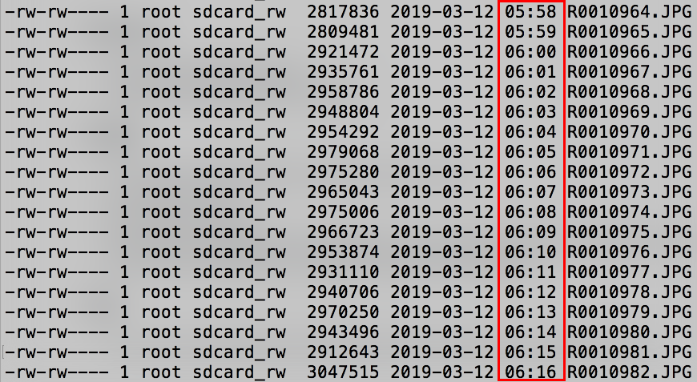

# Evercam's Free Construction Timelapse Plug-in For RICOH THETA

Personal project from the team at [Evercam](https://evercam.io/)

Take up to 4,500 timelapse pictures with your RICOH THETA. Enables switching between timelapse and single still image mode without the use of a mobile phone.

## Features

* 60 second delay between pictures
* disables automatic off and sleep during use

## Benefits

* Does not require mobile phone
* Can switch back to single shot mode by pressing the lower mode button to take camera out of plug-in mode
* Open source. You can use as a base for your customized construction workflow

## Usage

* connect camera with USB cable to power source over 2 amps
* put into plug-in mode
* press shutter button once
* press shutter button again to stop the timelapse. You can restart
the timelapse by pressing the shutter button again
* press the lower mode button for more than 2 seconds to stop the plug-in

## Tips
* if you want to take thousands of pictures, delete all other media
from your camera prior to use
* if you want to adjust the shutter volume, use the RICOH THETA mobile app
* Wi-Fi LED blinks yellow when plug-in is in use. Speeds up at 30 and 15 seconds
prior to shot
* Short audio beep at each interval. Cannot turn off the audio beep right now,
but if you need a silent mode, please put a comment on community.theta360.guide
and I'll add it in.
* when pressing the shutter botton to stop picture taking, the yellow Wi-Fi will go away, but one more picture is taken
* currently, the faster blinking yellow Wi-Fi continues after the last picture

## Motivation for Building

Although the RICOH THETA mobile app is great.  Some people do not like to use it onsite as they are trying to streamline a workflow.  Some phones may have problems with connection to the mobile app.  There's also times, when environmental factors such as heavy rain make it inconvenient to use the mobile phone. You can seal the RICOH THETA V in a TW-1 case, but your mobile phone may be exposed.  

With a plug-in workflow, the user can also take single pictures of sites before the plug-in is activated. 

By training your staff to put the camera into timelapse mode by pressing the lower mode button of the camera, it saves new or infrequent staff the hassle of downloading the mobile app and getting it to work with the camera.  In this scenario, you can just give the camera and USB power adapter to a staff member on site at a construction area with simpler instructions - "press lower button" and confirm LED is "Yellow".    You can even put an arrow sticker on the camera to indicate which button to press.

As this plug-in will be open source, it can be a base framework for custom workflow modifications.  In the future, people can change the delay and number of pictures in the code and have different plug-ins for different workflows.

## Example listing of pictures taken

## Example 1 Hour Construction Timelapse Test by .guide Community (62 pictures total, using Giphy to animate) 

https://media.giphy.com/media/l19hwg9Wgm0CWxwYcD/giphy.gif

